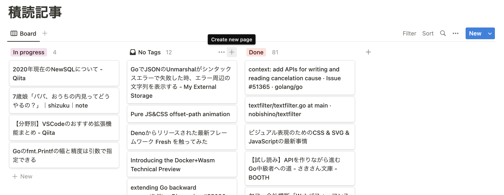

# twitterFavoriteList

## Objective

Reflect linked articles liked on twitter in notion's dashboard.

## environment

go version go1.18.1

## settings

You need to register twitter [developer portal](https://developer.twitter.com/en/portal/dashboard) and make [notion integration](https://www.notion.so/my-integrations).
In this app, use _twitter Bearer token_, _twitter user ID_, _notion integration token_ and _notion database ID_.

#### twitter Bearer token

_twitter Bearer token_ can get from twitter developer portal -> projects -> project_name -> Authentication Token -> Bearer Token

#### twitter user ID

_twitter user ID_ isn't string ID like _@hon_d7174_. You need to convert it to number ID.

#### notion integration token

_notion integration token_ can get from Notion My integration -> integration -> Secret -> Internal Integration Token. This integration need Capabilities(Update content, Insert content).

#### notion database ID

_notion database ID_ can get from notion page. "https://www.notion.so/${notion database ID}?v=xxxxxxxxxxxxxxxxxxxxxxxxxxxxxxxxxxxxxxxxxxxxxxxx" In this app, we use _notion Board_. So you should make _notion Board_ like below image.


## .env

env file locate on same path of main.go

```
BEARERTOKEN=${twitter api Bearer token}
USERID=${twitter user ID(number)}
NOTIONINTEGRATIONTOKEN=${notion integration token}
NOTIONDBID=${notion database ID}
```
